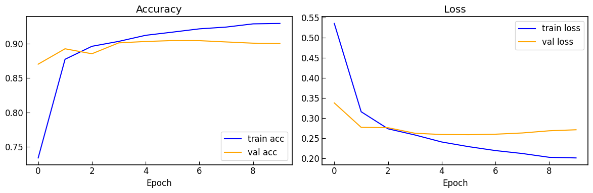
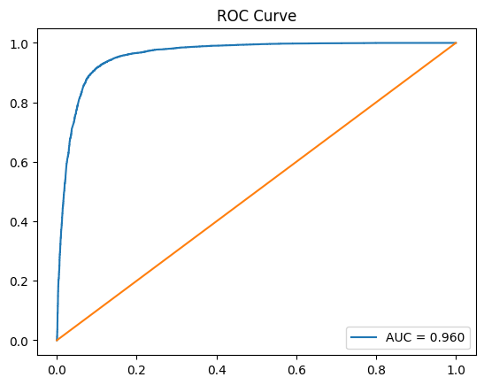
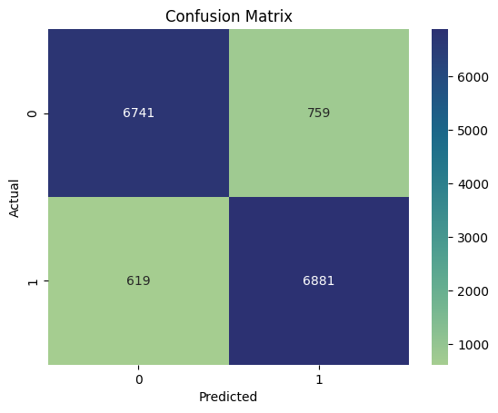
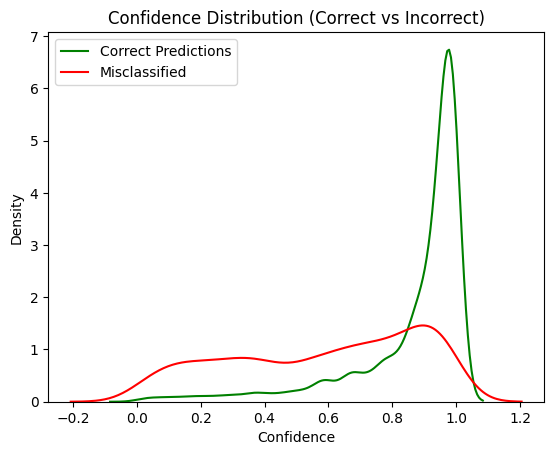
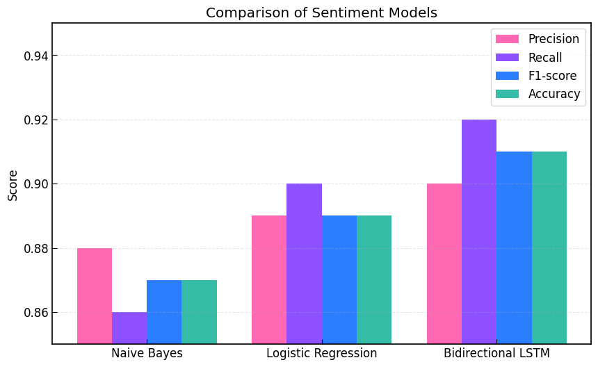

# 🛍️ Digikala Sentiment Analysis

A Persian Sentiment Analysis project on Digikala customer reviews using Deep Learning and Natural Language Processing (NLP).

## 📖 Overview

This project collects product reviews from Digikala, preprocesses Persian text, and trains a Bidirectional LSTM model to classify reviews into:

* 😊 Positive
* 😞 Negative

The dataset contains **150,000 balanced reviews** extracted from Digikala comments and prepared specifically for sentiment classification.

---

## 🚀 Features

✅ Persian text normalization using Parsivar

✅ Advanced text cleaning and preprocessing

✅ Balanced dataset generation

✅ TF-IDF and Deep Learning experimentation

✅ Bidirectional LSTM architecture

✅ Model checkpointing and early stopping

✅ Performance evaluation with multiple metrics

---

## 📂 Project Structure

```text
digikala_sentiment_analysis/
│
├── data/
│   └── digikala_150k.csv
│
├── final_best_lstm_model.keras
│
├── data_collection.ipynb
├── digikala_sentiment_analysis.ipynb
│
├── README.md
├── requirements.txt
└── .gitignore
```

---

## 📊 Dataset

Original dataset:

https://huggingface.co/datasets/RadeAI/Digikala_comments_products

### Data Collection

The dataset was shuffled and filtered based on review ratings:

| Rating | Label        |
| ------ | ------------ |
| 1, 2   | Negative (0) |
| 4, 5   | Positive (1) |

Final dataset:

* 75,000 Positive Reviews
* 75,000 Negative Reviews
* Total: 150,000 Reviews

---

## 🧹 Text Preprocessing

The preprocessing pipeline includes:

* Persian text normalization
* Character elongation removal
* URL removal
* Emoji removal
* Non-Persian character filtering
* Extra whitespace removal

Example:

```text
عااااالی بود 😍😍😍
↓
عالی بود
```

---

## 🧠 Model Architecture

The final model is based on:

* TextVectorization
* Embedding Layer
* Bidirectional LSTM
* Dense Layers
* Dropout Regularization

### Data Split

| Set        | Percentage |
| ---------- | ---------- |
| Train      | 80%        |
| Validation | 10%        |
| Test       | 10%        |

---

## 📈 Evaluation

Evaluation metrics include:

* Accuracy
* ROC Curve
* AUC Score
* Confusion Matrix
* Classification Report

---

## 📊 Results & Visualizations

### 📈 Training History

Model training performance across epochs.



---

### 🎯 ROC Curve

Receiver Operating Characteristic (ROC) curve of the final BiLSTM model.



---

### 🔍 Confusion Matrix

Performance of the final model on the test set.



---

### 📉 Confidence Distribution

Distribution of prediction confidence scores.



---

### 🏆 Model Comparison

Comparison between different sentiment classification models evaluated during the project.



---

## 🛠️ Technologies Used

* Python
* TensorFlow / Keras
* Scikit-Learn
* Pandas
* NumPy
* Parsivar
* Matplotlib
* Seaborn
* Hugging Face Datasets

---

## ⚙️ Installation

```bash
git clone https://github.com/melofy-vibes/digikala_sentiment_analysis.git

cd digikala_sentiment_analysis

pip install -r requirements.txt
```

---

## ▶️ Usage

### 1. Build Dataset

Run:

```bash
data_collection.ipynb
```

to generate:

```text
data/digikala_150k.csv
```

## 💾 Trained Model

The final trained model is included in this repository:

```text
final_best_lstm_model.keras
```

You can directly load the model using TensorFlow/Keras:

```python
from tensorflow.keras.models import load_model

model = load_model("final_best_lstm_model.keras")
```

---

## 📌 Future Improvements

* Transformer-based models (BERT / ParsBERT)
* Multi-class sentiment classification
* Sarcasm Detection
* Deployment with Streamlit

---

## 👩‍💻 Author

**Mehraveh Goharshadi**

Aspiring Data Scientist & Machine Learning Enthusiast


---

⭐ If you find this project useful, consider giving it a star!

